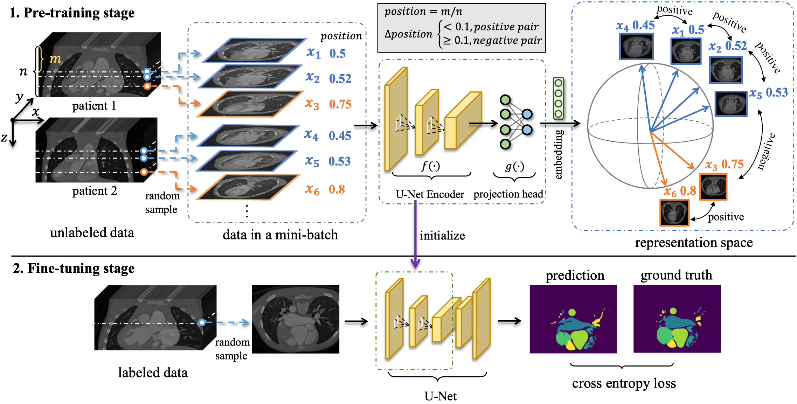

### Positional Contrastive Learning

Implementation of paper in 'Positional Contrastive Learning for Volumetric Medical Image Segmentation' ([paper](https://arxiv.org/pdf/2106.09157v3.pdf) @ MICCAI'21)

<p align="center">
  
</p>

### Dataset
 - Congenital Heart Disease (CHD) dataset, CT, [link](https://github.com/XiaoweiXu/Whole-heart-and-great-vessel-segmentation-of-chd_segmentation)
 - MMWHS dataset, CT, [link](http://www.sdspeople.fudan.edu.cn/zhuangxiahai/0/mmwhs/)
 - ACDC dataset, MRI, [link](https://www.creatis.insa-lyon.fr/Challenge/acdc/databases.html)
 - HVSMR dataset, MRI, [link](http://segchd.csail.mit.edu/)

### Preprocessing
Use the scripts in the `dataset` folder to preprocess the dataset, convert the original data into .npy for training and testing.
```
# convert the CHD dataset
python generate_chd.py -indir raw_image_dir -labeled_outdir save_dir_for_unlabeled_data -unlabeled_outdir save_dir_for_unlabeled_data
# convert ACDC dataset
python generate_acdc.py -i raw_image_dir -out_labeled save_dir_for_unlabeled_data -out_unlabeled save_dir_for_unlabeled_data
# convert MMWHS dataset
python generate_mmwhs.py -indir raw_image_dir -labeled_outdir save_dir_for_unlabeled_data
# convert HVSMR dataset
python generate_hvsmr.py -indir raw_image_dir -labeled_outdir save_dir_for_unlabeled_data
```

### Running

(1) PCL on CHD dataset
```
python train_contrast.py --device cuda:0 --batch_size 32 --epochs 300 --data_dir chd_dataset preprocessed_without_label/ --lr 0.1 --do_contrast --dataset chd --patch_size 512 512 \
--experiment_name contrast_chd_pcl_temp01_thresh01_ --slice_threshold 0.1 --temp 0.1 --initial_filter_size 32 --classes 512 --contrastive_method pcl
```

(2) PCL on ACDC dataset
```
python train_contrast.py --device cuda:0 --batch_size 32 --epochs 300 --data_dir acdc_dataset --lr 0.1 --do_contrast --dataset acdc --patch_size 352 352 \
--experiment_name contrast_acdc_pcl_temp01_thresh035_ --slice_threshold 0.35 --temp 0.1 --initial_filter_size 48 --classes 512 --contrastive_method pcl
```

(3) Semi-supervised finetuning on CHD dataset on 40 samples using 5-fold cross validation
```
python train_supervised.py --device cuda:0 --batch_size 10 --epochs 100 --data_dir chd_dataset --lr 5e-5 --min_lr 5e-6 --dataset chd --patch_size 512 512 \
--experiment_name supervised_chd_pcl_sample_40_ --initial_filter_size 32 --classes 8 --enable_few_data --sampling_k 40 \
--restart --pretrained_model_path /afs/crc.nd.edu/user/d/dzeng2/positional_cl/results/contrast_pcl_2020-11-27_17-08-52/model/latest.pth
```

(4) Transfer learning finetuning on MMWHS dataset on 10 samples using 5-fold cross validation
```
python train_supervised.py --device cuda:0 --batch_size 10 --epochs 100 --data_dir mmwhs dataset --lr 5e-5 --min_lr 5e-6 --dataset MMWHS --patch_size 256 256 \
--experiment_name supervised_chd_pcl_sample_40_ --initial_filter_size 48 --classes 8 --enable_few_data --sampling_k 10 \
--restart --pretrained_model_path /afs/crc.nd.edu/user/d/dzeng2/positional_cl/results/contrast_pcl_2020-11-27_17-08-52/model/latest.pth
```

Please refer to [run_script.sh](run_script.sh) for more experimental running commands

### Pretrained model

The pretrained model using PCL can be found [here](https://drive.google.com/drive/folders/16vnZj9c5Mp-9lazmHtR-01AxHGUe0q_6?usp=sharing). Note that for CHD, the initial_filter_size is 32. For ACDC, the initial_filter_size is 48 to align with a SOTA solution [link](https://github.com/MIC-DKFZ/ACDC2017).

### How to cite this code

Please cite the original publication:
```
@article{zeng2021positional,
  title={Positional Contrastive Learning for VolumetricMedical Image Segmentation},
  author={Zeng, Dewen and Wu, Yawen and Hu, Xinrong and Xu, Xiaowei and Yuan, Haiyun and Huang, Meiping and Zhuang, Jian and Hu, Jingtong and Shi, Yiyu},
  journal={arXiv preprint arXiv:2106.09157},
  year={2021}
}
```